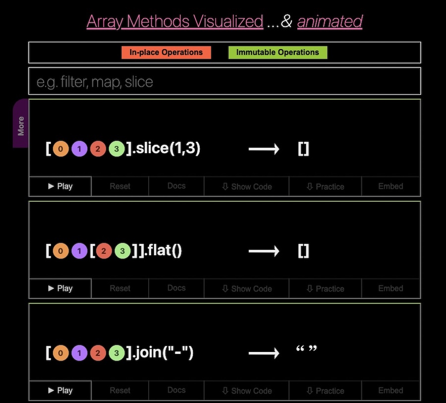
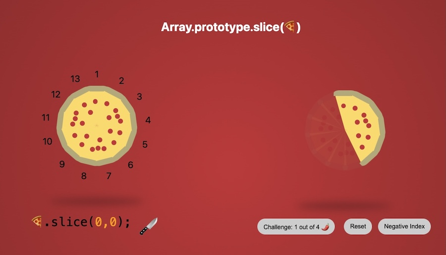

# JavaScript Visualized and Animated

[Demo (work in progress)](https://in-tech-gration.github.io/JavaScript.Animated/)

JavaScript.Animated welcomes:

- [Issues, bug reports and suggestions](https://github.com/in-tech-gration/JavaScript.Animated/issues)
- [Pull Requests](https://github.com/in-tech-gration/JavaScript.Animated/pulls)
- [Discussion and ideas](https://github.com/in-tech-gration/JavaScript.Animated/discussions)

## Development

  - Dev: `npm run dev`
    - Work on `./dev/index.js`
    - CSS: `/dev/style.css`
  - Build: 
    - `npm run build`
    - `npm run server` (manual testing)
    - `git add; git commit -m "Build"; git push`

## Created using:

  - [mo.js](https://mojs.github.io/)
  - Pizza slices by [Adam Kuhn](https://codepen.io/cobra_winfrey/pen/ygojOG)
  - Sound effects and music by [Mixkit](https://mixkit.co/)

